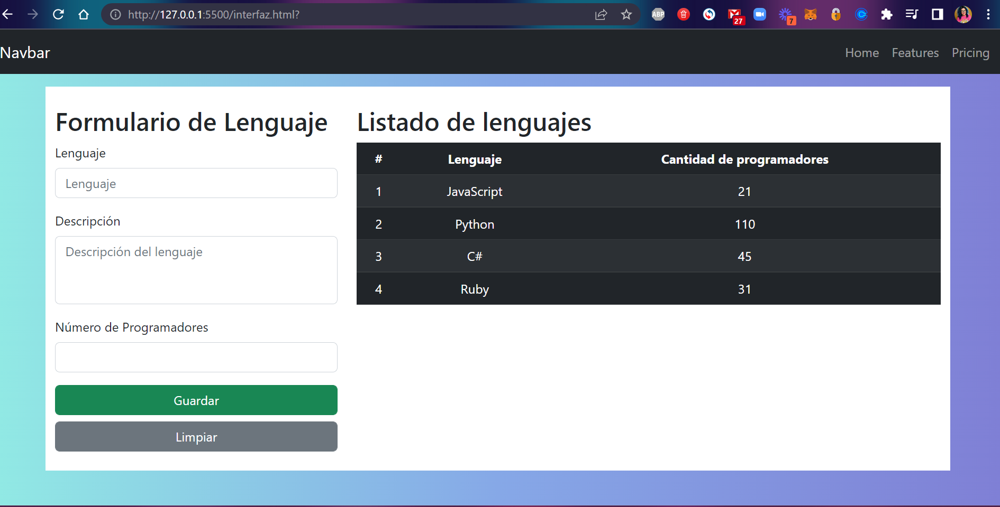

# Bootstrap: Ejercicio de Práctica

Aprende a utilizar el framework CSS Bootstrap en tus sitios web, entendiendo sus conceptos básicos y fundamentos de diseño, de esta manera podrás estilizar tus aplicaciones web muy fácilmente y volverlas responsivas (Responsive Design).

  

